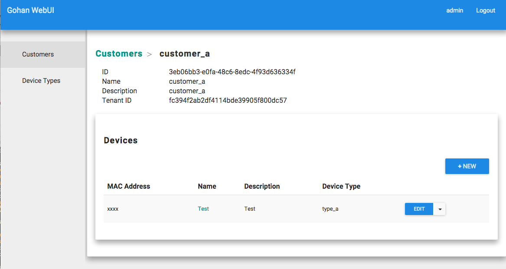

Gohan DB relation example
--------------------------

This is an example for how to use gohan DB relation.

In this example, we have three requirements.

(Req1) We should have Customer resource, Device resource, and DeviceType resource.
(Req2) A customer has multiple devices.
(Req3) A device has a reference to a DeviceType.

You can use "parent" property for (Req2)

``` YAML
- description: Devices
  id: device
  parent: customer
  plural: devices
  schema:
```

Gohan will add customer_id property for device schema automatically, and API Server & WebUI can understand
this relationship.

We can use "relation" and "relation_property" for (Req3).
You should specify schema_id for relation property.


``` YAML

      device_type_id:
        description: Device Type
        permission:
        - create
        - update
        relation: device_type
        relation_property: device_type
        title: Device Type
        type: string

```

You can get related objects in List and Show API using
relation_property. relation_property value will be used as a key for related object in the
response.

This is sample json output.

``` json
{
  "devices": [
    {
      "customer_id": "3eb06bb3-e0fa-48c6-8edc-4f93d636334f",
      "description": "Test",
      "device_type": {
        "description": "type_a",
        "id": "ca85ae8e-5496-47ed-b797-0456ef7c36f8",
        "name": "type_a",
        "tenant_id": "fc394f2ab2df4114bde39905f800dc57"
      },
      "device_type_id": "ca85ae8e-5496-47ed-b797-0456ef7c36f8",
      "id": "ceb760d9-ebc7-4ea2-8f71-dbc1b20f870a",
      "mac_address": "xxxx",
      "name": "Test",
      "tenant_id": "fc394f2ab2df4114bde39905f800dc57"
    }
  ]
}

```

This is sample screenshot.


